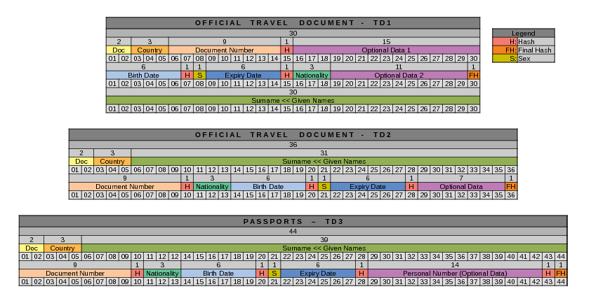

# LAGHIMA

This repository extracts the Machine Readable Zone (MRZ) from passport images. The MRZ typically contains important information such as the passport holder's name, nationality, passport number, and date of birth.

**🛠️Features:**

- Automatically detects and extracts the MRZ region from passport images.
- Utilizes contour detection to accurately identify the MRZ area.
- Outputs the extracted MRZ region as text for further processing or analysis.

**💡How to Use:**

- Clone the repository to your local machine.
- Install 'Tesseract OCR' engine
- Install required dependencies(mentioned in requirements.txt).
- Replace the default Tesseract model with 'data/eng.traineddata'

## MRZ Wiki

    
<b>📚MRZ Types</b>

The standard for MRZ code is strictly regulated and has to comply with [Doc 9303](https://www.icao.int/publications/pages/publication.aspx?docnum=9303). Machine Readable Travel Documents published by the International Civil Aviation Organization.

There are currently several types of ICAO standard machine-readable zones, which vary in the number of lines and characters in each line:

- TD-1 (e.g. citizen’s identification card, EU ID card, US Green Card): consists of 3 lines, 30 characters each.
- TD-2 (e.g. Romania ID, old type of German ID), and MRV-B (machine-readable visas type B — e.g. Schengen visa): consists of 2 lines, 36 characters each.
- MRP (all international passports, also known as TD-3), and MRV-A (machine-readable visas type A — issued by the USA, Japan, China, and others): consist of 2 lines, 44 characters each.

    
<b>📝MRZ format</b>

Now, based on the example of a national passport, let us take a closer look at the MRZ composition.

- **Top Line**
  

  
  The first character indicates the type of document: P - means machine-readable passport (as opposed to, for example, V in MRV-A(B) type of MRZ, corresponding to a visa document). The state or organization issuing the passport can use the second character to determine the passport type (civil, official, diplomatic, service, etc.). If the passport type is not specified, then a placeholder (<) is inserted instead. The following three characters show the country that issued the passport under ISO 3166–1 alpha-3 with some minor exceptions, or the organization that is authorized to issue passports and other machine-readable documents (for example, UN, Interpol, EU Council). The next 39 characters of the first line provide the name of the passport’s owner. First comes the primary identifier, or the last name. If the last name consists of several words, then a placeholder (<) is used between them. Punctuation marks — hyphens, apostrophes, and commas, used in the VIZ, are not used in machine-readable lines. Instead of punctuation marks, a placeholder is used again.

  In the machine-readable zone, the last name is separated from the given name(s) with two placeholder characters (<<). In the same way as in a last name, if there are several given names or if they consist of several words, they are separated by placeholder characters.

  The number of characters per line is limited. For a passport, each MRZ line must contain exactly 44 characters. Therefore, if the full name is too long and does not fit into one line, the first name gets abbreviated, as it is the second identifier concerning the last name.

  In a machine-readable zone, only Latin characters without diacritics are used, thus specific transliteration rules have to be applied to names written with diacritical marks or using other alphabets.
  

- **Bottom Line**
  

  The first 9 characters of the second line of the passport’s machine-readable zone is the document number. Although in most countries that use machine-readable zones in their documents, passport numbers are converted to a 9-digit form, in some cases, the total number of characters may be more or less. If there are more characters in the number, those that did not fit in the allotted 9 places go into the “optional data” zone. The 10th character is there to verify the correctness of the number and is calculated using a special algorithm based on the first 9. The following three characters indicate the citizenship of the passport holder. The citizenship code is written in the ISO 3166–1 alpha-3 international format (with some minor exceptions), there are additional codes such as for stateless persons (the characters would be XXA), or for refugees (XXB or XXC). The next 6 digits are the date of birth in the YYMMDD format, and the character following that date is the check digit, which is calculated by a special algorithm based on the date of birth. The next character indicates the gender of the passport holder: male (M), female (F), or a placeholder < in case the person has not decided on their gender or refused to provide it. The next 6 digits indicate the validity period of the passport in the YYMMDD format, followed by the check digit. The next 14 characters represent optional data at the discretion of the issuer. If there is no personal number or other information, this entire field is filled with placeholders. If the personal number data is not available, then its check digit will be indicated either as 0 or as a placeholder. The last digit on the bottom line of the MRZ passport is a check digit calculated using all the characters in the bottom line, except for the characters indicating gender and citizenship.
  

